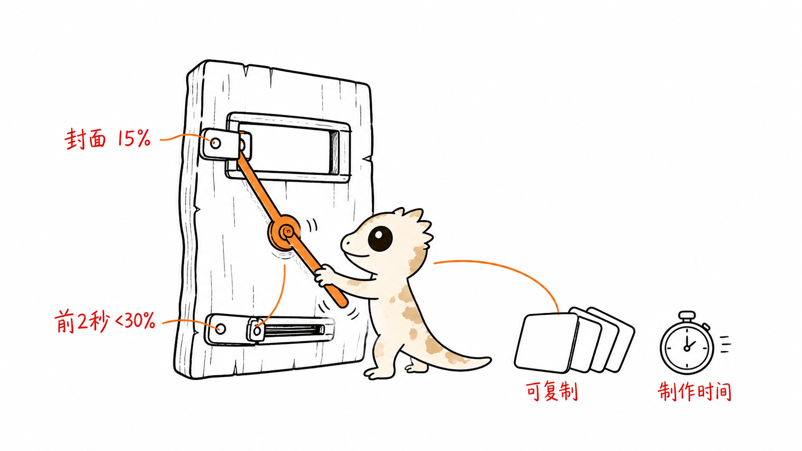
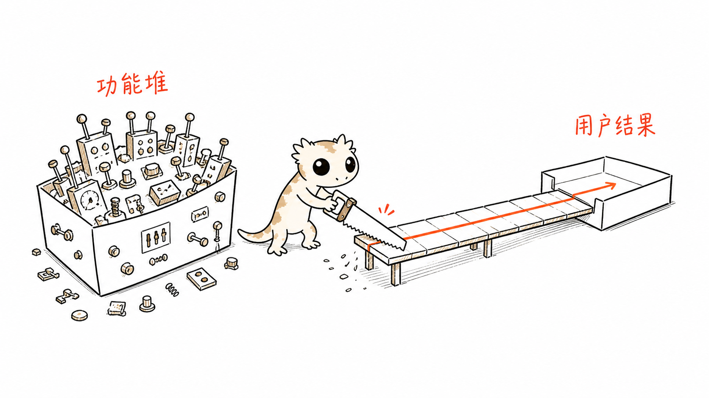
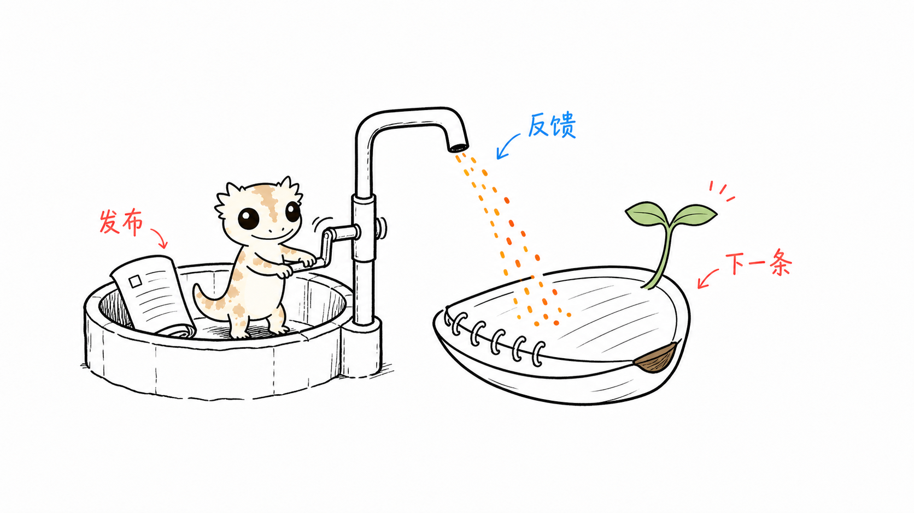

# 小gecko 配图

> 一只奶油色 gecko，专门把中文内容里的抽象判断，变成读者一眼能看懂的怪诞手绘图。
>
> 16:9 横版 · 纯白手绘 · 认知锚点 · 可复用隐喻 · Codex Skill

<p align="center">
  <a href="https://www.douyin.com/user/MS4wLjABAAAAHH81Iv6MWugNS03rPOnWulSnhRbM26Ud_S16rlgqOfY4nR8bznDSWbFIcviihJJm"></a>&nbsp;&nbsp;&nbsp;
  <a href="https://www.xiaohongshu.com/user/profile/5df3742d000000000100212a"></a>&nbsp;&nbsp;&nbsp;
  <a href="https://x.com/xDylanLong"></a>&nbsp;&nbsp;&nbsp;
  <a href="https://looda.cc"></a>
</p>

<p align="center"><sub><a href="https://www.douyin.com/user/MS4wLjABAAAAHH81Iv6MWugNS03rPOnWulSnhRbM26Ud_S16rlgqOfY4nR8bznDSWbFIcviihJJm">抖音</a> · <a href="https://www.xiaohongshu.com/user/profile/5df3742d000000000100212a">小红书</a> · <a href="https://x.com/xDylanLong">X / Twitter</a> · <a href="https://looda.cc">looda.cc</a></sub></p>

---

## 它解决什么问题

很多内容配图的问题不是“画得不够漂亮”，而是没有把文章里真正重要的那一下画出来：一个判断、一个断点、一个转折，或者一条从想法走到结果的路径。

小gecko 配图让 AI 先找出那个认知锚点，再为它发明一个低科技、奇怪但成立的物理隐喻。最终输出不是课程页，也不是一堆节点，而是一张读者看一眼就能进入正文的手绘图。

## 这不是原仓库的复制版

这个项目参考了 [Ian Xiaohei Illustrations](https://github.com/helloianneo/ian-xiaohei-illustrations) 的部分工作方法和 README 信息组织方式，但重新设计了：

- 角色：从黑色小怪物改为用户提供的奶油色小 gecko
- 视觉资产：独立的三视图角色参考、gecko 角色规范和配色规则
- 内容语气：更偏产品、AI、增长、内容实验和一人公司场景
- Demo 与 prompts：全部围绕小 gecko 重新生成，不复刻原仓库案例
- 仓库入口：加入作者的抖音、小红书、X 和个人网页，方便直接分享

原仓库是方法参考，不是本项目的内容来源或角色资产来源。更完整的致谢与再分发说明见 [NOTICE.md](NOTICE.md)。

## 小 gecko 是谁

小 gecko 是一只奶油白、浅棕斑纹、深色大圆眼、头顶尖轮廓、短小四肢、拖着长尾巴的小角色。

它不会站在画面旁边当贴纸，而是负责做那件解释概念的怪事：锯掉功能堆、拧开内容入口、摇动反馈井、把抽象东西塞进一个能工作的机器里。

角色参考图在这里：[gecko-reference.png](xiao-gecko-illustrations/assets/gecko-reference.png)。

## 三条设计原则

### 1. 一张图只讲一个动作

不要把整篇文章压进一张图。先选一个读者应该记住的动作，再删掉其他解释。

### 2. 角色必须参与运转

如果去掉小 gecko，画面仍然完全成立，说明角色只是装饰。小 gecko 要推、拉、拧、扛、修、捞、记录，或者认真地卡在某个系统里。

### 3. 怪，但要在一秒内看懂

白底、少字、留白和一个奇怪物件负责制造记忆点；短标注和清晰动线负责让读者迅速理解。

## Demo

### 内容入口实验

把封面点击率、前 2 秒留存、可复制结构和制作时间画成同一个入口的四个短标记。



### 从功能堆到用户结果

小 gecko 用一把锯子削掉多余功能，再把一条清晰路径搭向用户结果。



### 发布到反馈回流

小 gecko 摇动反馈井，让发布之后的反馈回到下一条内容里。



这些 demo 是工作方式的示范，不是固定构图。每次使用都应根据当前内容重新发明隐喻。

## 怎么安装

```bash
git clone https://github.com/xDylanLong/xiao-gecko-illustrations.git
cd xiao-gecko-illustrations
mkdir -p "${CODEX_HOME:-$HOME/.codex}/skills"
cp -R ./xiao-gecko-illustrations "${CODEX_HOME:-$HOME/.codex}/skills/"
```

Windows PowerShell：

```powershell
$skillRoot = if ($env:CODEX_HOME) { Join-Path $env:CODEX_HOME "skills" } else { Join-Path $HOME ".codex/skills" }
New-Item -ItemType Directory -Force -Path $skillRoot | Out-Null
Copy-Item -Recurse -Force .\xiao-gecko-illustrations (Join-Path $skillRoot "xiao-gecko-illustrations")
```

安装后，在 Codex 中直接调用：

```text
Use $xiao-gecko-illustrations 为这篇中文内容生成一张小 gecko 正文配图。
```

## 常用用法

### 先做 shot list，不生图

```text
Use $xiao-gecko-illustrations 先不要生图。
请从下面文章里找出 5 个最值得视觉化的认知锚点。
每个锚点写：放在哪段后、核心意思、构图类型、小 gecko 的动作、3-5 个短标注。

<粘贴文章>
```

### 直接做一张图

```text
Use $xiao-gecko-illustrations 为“产品不是功能堆，而是让用户更快到达一个结果”生成一张 16:9 横版正文配图。
要求纯白背景、手绘线稿、少量中文批注，小 gecko 必须承担核心动作。
```

### 做内容实验复盘图

```text
Use $xiao-gecko-illustrations 把这周的内容实验画成一张图：
小红书封面点击率目标 15%，抖音前 2 秒跳出率低于 30%，找到可复制的封面结构和开头结构，并记录制作时间。
只保留一个核心隐喻，不要做成 PPT。
```

更多可复用 prompts 见 [examples/prompts.md](examples/prompts.md)。

## 从正文到成图

1. 读取文章、帖子、Markdown、截图或一个明确主题
2. 找出认知转折、输入输出、断点、前后状态或承接关系
3. 只选一个认知锚点，必要时先给出 shot list
4. 选择一种结构：概念隐喻、前后对比、系统局部、方法分层、地图路线或小漫画
5. 为当前内容发明一个低科技物件，并让小 gecko 做核心动作
6. 用内置图像模型逐张生成，不把多张图拼成一张
7. 检查角色、白底、留白、短文字和非 PPT 感
8. 把最终 PNG 保存到 workspace 的 `assets/<article-slug>-illustrations/`

## 仓库结构

```text
.
├── README.md
├── LICENSE
├── NOTICE.md
├── examples/
│   ├── images/
│   │   ├── 01-content-entrance-experiment.png
│   │   ├── 02-product-feature-pile.png
│   │   └── 03-content-feedback-loop.png
│   └── prompts.md
└── xiao-gecko-illustrations/
    ├── SKILL.md
    ├── agents/openai.yaml
    ├── assets/gecko-reference.png
    └── references/
        ├── composition-patterns.md
        ├── gecko-ip.md
        ├── prompt-template.md
        ├── qa-checklist.md
        └── style-dna.md
```

## 使用边界

- 它适合正文认知锚点，不适合商业 KV、完整海报或高密度数据图。
- 中文文字越短越稳定；出现错字时优先删字，不要继续堆提示词。
- Demo 只校准风格密度和角色参与方式，不应被当成固定模板。
- 每张图的实际生成额度取决于当前 Codex / 图像模型环境，本仓库不承诺固定点数或金额。

## License 与致谢

本项目采用 [MIT License](LICENSE)。

小 gecko 角色参考图与 demo 图由本项目作者提供或生成。方法论部分参考了 [Ian Xiaohei Illustrations](https://github.com/helloianneo/ian-xiaohei-illustrations)，但本项目的角色、资产、demo、prompts 和 README 已重新组织。详细说明见 [NOTICE.md](NOTICE.md)。

